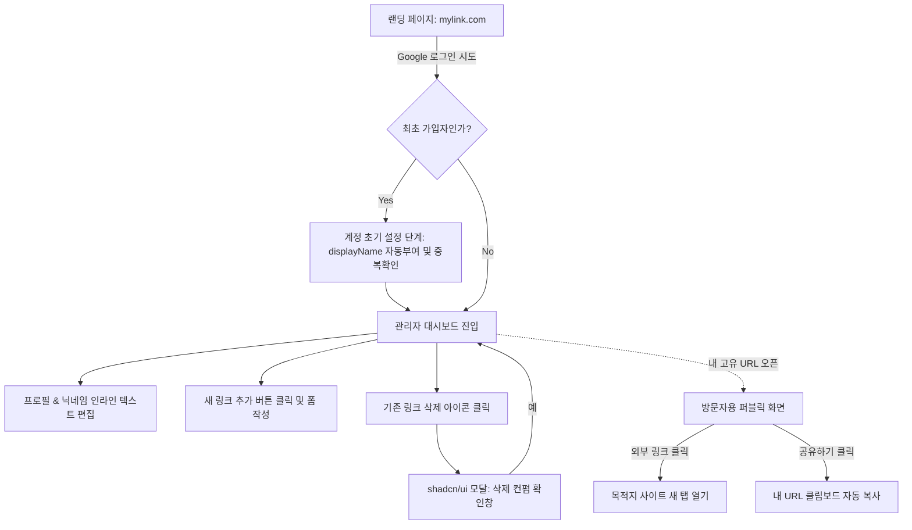

# 마이링크 (My Link) 와이어프레임 설계

본 문서는 방문자와 소유자가 보게 될 화면의 레이아웃 구조와 사용자 흐름을 시각적으로 정의합니다. UI 컴포넌트는 기획된 대로 **shadcn/ui** 디자인 시스템을 기반으로 구성됩니다.

## 1. 퍼블릭 화면 (방문자용 모바일 최적화 뷰)

방문자가 `mylink.com/displayName` 형태의 링크를 방문했을 때 보게 될 모바일(세로형) 기준 레이아웃입니다. (단일 라이트 테마로 제공)

```text
+--------------------------------------------------+
| [MyLink 로고]            [공유하기(Share) 아이콘] |
+--------------------------------------------------+
|                                                  |
|                  ( photoURL )                    |
|                [ **username** ]                  |
|                 @displayName                     |
|          "프로필 한 줄 소개글 (Bio)"             |
|                                                  |
|  +--------------------------------------------+  |
|  | (Favicon)    나의 개인 포트폴리오 웹사이트 |  |
|  +--------------------------------------------+  |
|                                                  |
|  +--------------------------------------------+  |
|  | (Favicon)    운영 중인 유튜브 채널         |  |
|  +--------------------------------------------+  |
|                                                  |
|  +--------------------------------------------+  |
|  | (Favicon)    깃허브(GitHub) 레포지토리     |  |
|  +--------------------------------------------+  |
|                                                  |
+--------------------------------------------------+
```

## 2. 관리자 화면 (소유자용 대시보드 뷰)

소유자가 구글 소셜 로그인 후 자신의 프로필과 링크를 관리하는 화면입니다. 퍼블릭 뷰와 유사하지만 텍스트 수정이 가능한 '인라인 편집' 폼의 성격을 지니며, 링크 삭제 기능이 추가되어 있습니다.

```text
+--------------------------------------------------+
| [MyLink 로고]           (프로필 이미지 드롭다운) |
|                  +---------------------------+   |
|                  | 사용자 이름               |   |
|                  | user@email.com            |   |
|                  |---------------------------|   |
|                  | 👁 내 페이지 미리보기     |   |
|                  | 📋 링크 복사              |   |
|                  |---------------------------|   |
|                  | 🚪 로그아웃               |   |
|                  +---------------------------+   |
+--------------------------------------------------+
|                                                  |
|                  ( photoURL )                    |
|             [ username 인라인 편집 폼 ✎ ]        |
|                 @displayName                     |
|          [ 한 줄 소개글 인라인 편집 폼 ✎ ]       |
|                                                  |
|  +--------------------------------------------+  |
|  | (Favicon)   [Title 폼] | [URL 폼]   [삭제] |  |
|  +--------------------------------------------+  |
|                                                  |
|  +--------------------------------------------+  |
|  | (Favicon)   [Title 폼] | [URL 폼]   [삭제] |  |
|  +--------------------------------------------+  |
|                                                  |
|        [ ➕ 새로운 링크 블록 추가하기 ]          |
|                                                  |
+--------------------------------------------------+
```
*(※ 프로필 이미지 클릭 시 드롭다운 메뉴가 열리며, 계정 정보·내 페이지 미리보기·링크 복사·로그아웃 기능을 제공합니다.)*
*(※ 삭제 버튼 클릭 시 브라우저 내장 알림이 아닌, **shadcn/ui 기반의 깔끔한 모달(AlertDialog) 창**이 노출되어 정말 삭제할지 다시 한 번 확인합니다.)*

---

## 3. 화면별 사용자 흐름도 (Screen Flow)

Mermaid 다이어그램을 활용한 전체 서비스의 주요 컴포넌트 간 이동 및 상태 흐름입니다.


